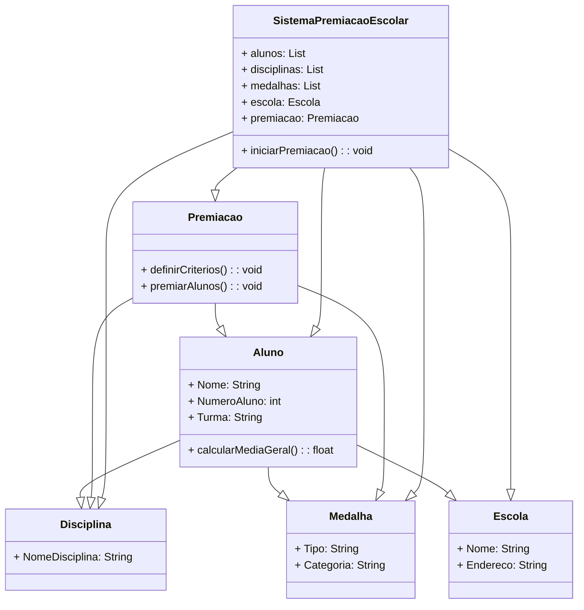

# Formação de Inteligência Artificial

**Formação de Inteligência Artificial** da Digital Innovation One (DIO), uma experiência guiada pelos renomados especialistas Felipe Silva Aguiar, Venilton Falvo e Diego Renan Bruno. Esta formação, dividida em três módulos, é muito mais do que um curso; é uma jornada transformadora no universo da tecnologia e inovação.

Ao longo dessa formação, pude explorar de maneira profunda e acessível os fundamentos, aplicações práticas e os pilares essenciais da Inteligência Artificial (IA)...principalmente para dar um feedback para os colegas que não são do universo TI. A DIO não apenas oferece conhecimento, mas também cria uma imersão que vai além das expectativas, proporcionando uma compreensão completa e prática do potencial exponencial da IA para o dia dia e todas as áreas ideias e etc.

Os instrutores da DIO não apenas compartilham conhecimento, mas o fazem com carinho, comunicação clara e um compromisso inigualável. Cada módulo é cuidadosamente construído, oferecendo não apenas informações, mas uma experiência educacional única e enriquecedora.

Esta é uma oportunidade única para adquirir habilidades práticas e teóricas que irão redefinir seu entendimento e uso da IA no mundo contemporâneo. Agradeço à DIO por oferecer uma formação tão excepcional e por seu comprometimento em capacitar profissionais de maneira impactante.

## 📒 ESTE PROJETO FAZ PARTE DA FORMAÇÃO! Essa foi minha ideia, você pode ter milhares como explica claramento o professor Venilton Falvo.
# Descrição do Projeto:
### Desenvolvi um sistema de premiação escolar utilizando Diagramas de Classe UML para representar a entrega de medalhas aos melhores alunos da escola. O sistema considera tanto classificações gerais quanto específicas por disciplina.

## 🤖 Tecnologias Utilizadas
- [Lucidchart](https://www.lucidchart.com/): Ferramenta online para criação de diagramas UML.
- [PlantUML](https://plantuml.com/): Linguagem de marcação para a definição de diagramas de UML.
- [Visual Studio Code](https://code.visualstudio.com/): Utilizado para editar e visualizar os arquivos PlantUML.

## 🧐 Processo de Criação
1. **Identificação de Classes e Atributos:** Analisei o contexto do negócio e identifiquei as classes principais (Aluno, Disciplina, Medalha, Escola) e seus atributos.
2. **Definição de Relacionamentos:** Estabeleci as relações entre as classes, como a relação entre Aluno e Disciplina.
3. **Representação de Hierarquias:** Em casos de herança, como por exemplo, entre Medalha e MedalhaGeral ou MedalhaDisciplina, utilizei hierarquias.
4. **Modelagem de Métodos (Opcional):** Adicionei métodos relevantes, como "CalcularMediaGeral" na classe Aluno.

## 🚀 Resultados
Os diagramas de classe UML resultantes proporcionam uma visão clara da estrutura do sistema de premiação, incluindo as relações entre as entidades e os critérios de decisão para os alunos classificados.

# Mermaid: Linguagem de Marcação para Diagramas

O **Mermaid** é uma linguagem de marcação para a criação de diagramas de forma simples e integrada aos arquivos Markdown. Ele permite que você descreva diagramas de fluxo, diagramas de sequência, diagramas de classe, entre outros, usando uma sintaxe fácil de entender.

## Principais Vantagens

A principal vantagem do Mermaid é a sua simplicidade e legibilidade. Com uma sintaxe clara e concisa, é possível criar diagramas de maneira eficiente, tornando-o uma escolha popular para documentação em Markdown, wikis e outros ambientes.

### Exemplo de Diagrama de Classe UML (em linguagem Mermaid)

## 🚀 Resultados
Os diagramas de classe UML resultantes proporcionam uma visão clara da estrutura do sistema de premiação, incluindo as relações entre as entidades e os critérios de decisão para os alunos classificados.

### Exemplo de Diagrama de Classe UML

Este diagrama foi gerado utilizando a linguagem [Mermaid](https://mermaid-js.github.io/mermaid/), uma ferramenta de marcação que permite a criação de diagramas de maneira fácil e integrada aos arquivos markdown. A representação visual é gerada dinamicamente pela própria plataforma ao visualizar este README.

## 💭 Reflexão (Opcional)
Refleti sobre a importância de representar de forma clara e precisa as relações entre as entidades do sistema de premiação. Os diagramas UML facilitaram a comunicação e compreensão do sistema.

## Como Contribuir
Sinta-se à vontade para contribuir para o projeto, fornecendo feedback ou sugerindo melhorias nos diagramas de classe. Basta criar um pull request e ficarei feliz em revisar!

*Este README foi criado com a assistência do ChatGPT. Com base nos requisitos de negócio do projeto analisando as histórias(ágil/Scrum), o ChatGPT também criou a linguagem(script) do Mermaid gerando os Diagrams de Classes do projeto 🤖✨*
